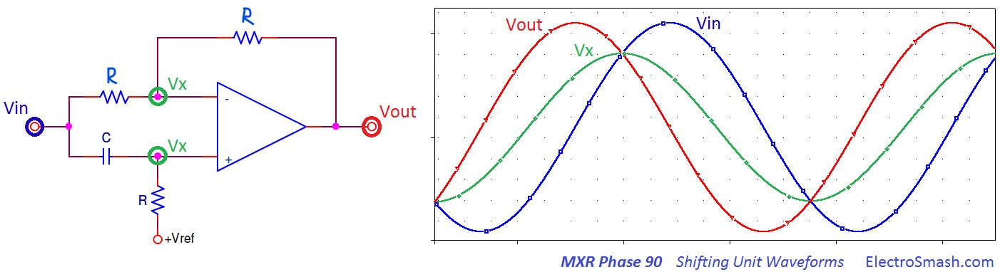

## MXR Phase 90 Guitar Pedal
MXRPhase 90 guitar Pedal has been realized in Julia and MATLAB

## Short Description about MXRPhase90
The MXR Phase 90 is a four-stage phaser guitar pedal and the debut product of MXR company in 1974. MXR phasers are highly praised due to their reliability, simple and compact design which is capable of producing high-quality phase-shift effects in comparison with other models. MXR 90 is considered to be a versatile pedal because of its capability of generating different phaser effects within one and this can be used in different musical art forms across the world. A few well-known guitarists/artists who created their composition with MXR 90 are Edward van Halen, lead guitarist and co-founder of American rock band Van Halen, David Gilmour, lead guitarist in Pink Floyd, Mick Jones, lead guitarist and co-founder of The Clash etc.

Early MXR models are called Script and Black Logo models due to the distinctive font of MXR on its front and later block-letter logos inside a black box.


MXR 90 is a simple to use pedal which can produce different sound effects with a single knob. MXR 90 is a relatively simple circuit that relies on OPAMPs and nonlinear circuit elements for signal amplification and filtering. It uses JFETs to achieve a distinct sound effect. This project work aims on the modeling and simulation of this JFET-based audio circuit along with its practical implementation in the ACME package of Julia. ACME is a standard library developed to model and simulate different electronic circuits centering on audio circuits.

The below represents schematic diagram of MXR Phase 90. The complete circuit has been divided into 5 main parts: Input Buffer, Power Supply, Phase Shifting Stage, Output Mixer, and LFO.


### Project Struture


List of components used in the circuit are listed below: 

| Components  | Value |
| :---------: | :---: | 
| C1,C2,C3,C4,C6,C9 | 47 nF | 
| C5 | 0.01 &micro;F| 
| Q1 | 2N4125 |
| Q2,Q3,Q4,Q5 | 2N5952 |
| R1,R3,R5,R10,R11,R12,R13,R17,R18 | 10K |
| R2,R7,R8,R16 | 150K |
| R4 | 56K |
| R6,R23,R25,R26 | 24K |
| R14 | 470K |
| U1a,U2d,U2c,U2b,U2a | TL061 |

### Phaser Effect

The phaser effect can be described as a type of phase modulation that creates an interference pattern by shifting the phase of one signal amongst the pair of the incoming audio signals by 180&deg;. One path, called the dry signal, is not affected by the phaser. The other path, called the wet signal, passes through a sequence of flters and then modulated by LFO.


Since the two signals have a 180&deg; phase difference, they cancel out each other during intersection as depicted in the above figure which results in creating a notch (signal cancellation) in the frequency domain.


### Phase 90 Shifting Unit

Each of the elementary units will shift the phase of the original signal by 90&deg;. The elementary unit comprises of the RC circuit that causes frequency-dependent phase delay and it is fed into the input of OPAMP circuit.
Using inverting OPAMP formula, it can be shown that a single elementary unit will shift the original signal upto 90&deg;.

$$\frac{V_x - V_{in}}{R}  = \frac{V_{out} - V_x}{R}$$
$$ V_{out} = - V_{in} + 2V_x$$



In the above figure, it has been considered that the input signal (highlighted in Blue) has a initial phase of 0&deg;. $V_x$ is the intermediate signal on two terminals of the OPAMP. (+) terminal has high pass filter configuration. The output signal will be calculated as follows:

$$V_{in} = \sin(2\pi f_ct)$$
$$\angle{V_x} = \tan^{-1}({\omega RC}) = \tan^{-1}(2\pi f_cRC) = 45^{\circ} ;[f_c = \frac{1}{2\pi RC}]$$
$$V_{x} = \frac{1}{\sqrt{2}}\sin(2\pi f_ct + 45^{\circ})$$
$$V_{out} = -\sin(2\pi f_ct) + 2(\frac{1}{\sqrt{2}}\sin(2\pi f_ct + 45^{\circ}))$$
$$V_{out} = -\sin(2\pi f_ct) + \sin(2\pi f_ct) + \cos(2\pi f_ct) = \cos(2\pi f_ct )$$

From the above equation, it is proved that the input signal is shifted in phase by 90&deg; at the output. Therefore, combining two elementary units in series will cause a shift up to = 90&deg;+90&deg;= 180&deg; and will create a notch at the specific frequency. In this circuit 4 elementary shifting units have been added in series, therefore, creating two notches.

### JFET Model Development in ACME
In this project, the JFET model has been developed in ACME source code library of Julia. Current and Voltage elements inside the JFET model including polarity has been expressed using the state-space mathematical model.
JFET behavior can be described mathematically as:
$$
	I_d =\begin{cases}
				0, & \text{if $V_{gs} \leq V_p \hspace{1mm} \cap \hspace{1mm} V_{ds} \geq 0 $}\\
				2\cdot(\frac{I_{DSS}}{V_p^2})\cdot(V_{gs} - V_p - \frac{V_{ds}}{2}) \cdot V_{ds}, & \text{if $V_{ds}<V_{gs} - V_p \hspace{1mm} \cap\hspace{1mm}  V_{ds} \geq 0 $}\\
				I_{DSS} \cdot (1-(\frac{V_{gs}}{V_p})^2) & \text{if $V_{ds} \geq V_{gs} - V_p \hspace{1mm} \cap \hspace{1mm}  V_{ds} \geq 0 $}
			\end{cases}
$$

```
function jfet(typ; vp, idss, λ)
    if typ == :n
        polarity = 1
    elseif typ == :p
        polarity = -1
    else
        throw(ArgumentError("Unknown JFET type $(typ), must be :n or :p"))
    end
            return ACME.Element(mv=[-1 0; 0 -1; 0 0; 0 0],
                mi=[0 0; 0 0; 0 -1; 1 0],
                mq=polarity*[1 0 0; 0 1 0; 0 0 1; 0 0 0],
        ports=[:gate => :source, :drain => :source],
        nonlinear_eq = @inline function (q)
            vgs, vds, id = q
            id = id
            vp1 = polarity*vp
            K = (idss/vp1^2)
        if vgs <= vp1 && vds >= 0
            res = @SVector [-id]
            J = @SMatrix [0.0 0.0 -1.0]
        elseif vds < vgs - vp1 && vds >= 0
            res = @SVector [(2*K*(vgs-vp1-(vds/2))*vds*(1+λ*vds)) - id]
            J = @SMatrix [((2*K*vds)*(1+λ*vds)) (2*K*(vgs-vp1-vds)+(K*λ*(4*vgs-4*vp1-3*vds)*vds)) -1.0]
        elseif vds >= vgs - vp1 && vds >= 0
            res = @SVector [idss*((1-vgs/vp1)^2)*(1+λ*vds) - id]
            J = @SMatrix [(2*(-(idss/vp1))*(1-vgs/vp1)*(1+λ*vds)) (idss*((1-vgs/vp1)^2)*λ) -1.0]
        else
            res = @SVector [-id]
            J = @SMatrix [0.0 0.0 -1.0]
            end
            return (res,J)
        end)
    end
```
